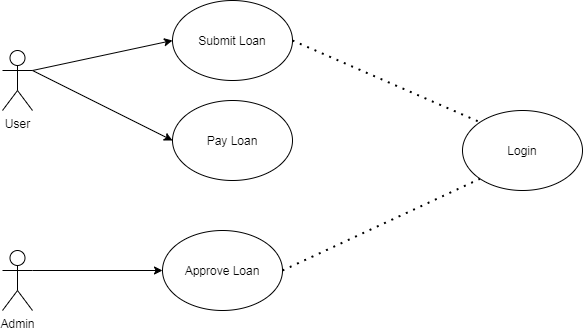

## System requirement
- Apache 2
- PHP 7.4
- My SQL 5.5
- Laravel 5.4
- Composer
## Config 
- Apache : 
    ```
    <VirtualHost *:80>
        ServerName localhost
        DocumentRoot [path to app]/public
        <Directory [path to app]/public>
            Options Indexes FollowSymLinks MultiViews
            AllowOverride All
            Order allow,deny
            Allow from all
        </Directory>
    </VirtualHost>
    ``` 
- Laravel 
    ```
    composer install
    ```
- Mysql 
    ```
        # Install database
        php artisan app:createDatabase

        # Create tables
        php artisan migrate
        
        # Create admin user
        php artisan db:seed
    ```
- Admin login information
    + email : admin@gmail.com
    + password : admin
- User login information
    + email : user@gmail.com
    + password : user
## User stories

1.
```
As an user 
I want to register and login 
So that I need a login screen and register screen 
``` 

2.
```
As a user 
I want to submit a loan request
So that I need a form to submit with amount and term
```

3.
```
As an user 
I want to pay a loan every week
So that I need a button to pay when pay date come.
```

3.
```
As an admin 
I want to approve a loan request
So that I need a button to approve when paying request came
```
